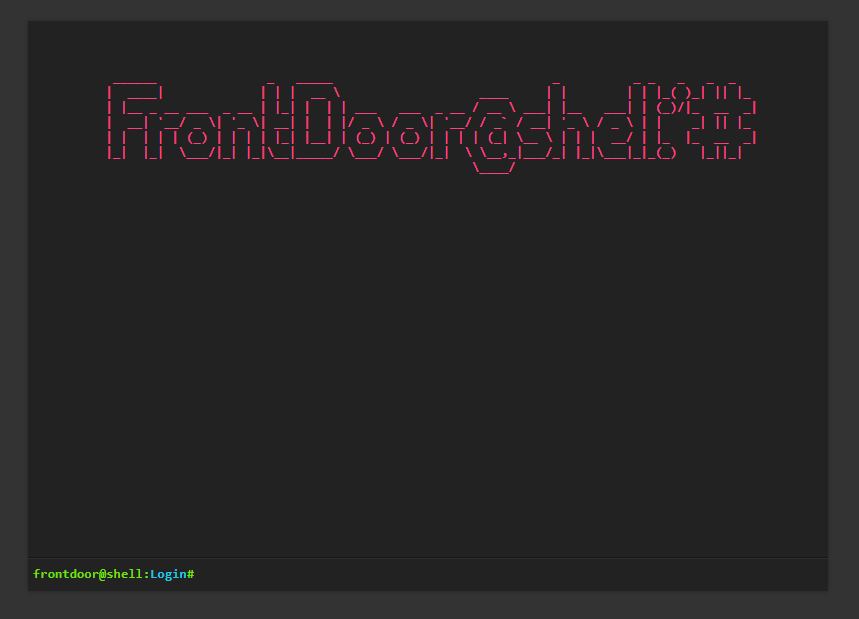

# frontdoor@shell:~# -- Single-file PHP Shell

frontdoor@shell:~# is a very basic, single-file, PHP shell. It can be used to quickly execute commands on a server when pentesting a PHP application. Use it with caution: this script represents a security risk for the server.

This repo forked from [flozz/p0wny-shell](https://github.com/flozz/p0wny-shell), i just added a few features.

**Features:**

* Command history (using arrow keys`↑↓`)
* Auto-completion of command and file names (using`Tab` key)
* Navigate on the remote file-system (using`cd` command)
* Upload a file to the server (using`upload <destination_file_name>` command)
* Download a file from the server (using`download <file_name>` command)
* Login and Logout feature to secure your terminal

**WARNING:** THIS SCRIPT IS A SECURITY HOLE. **DO NOT** UPLOAD IT ON A SERVER UNTIL YOU KNOW WHAT YOU ARE DOING! I AM NOT RESPONSIBLE IF THIS CODE IS USED FOR ILLEGAL PURPOSES.

#### How to use:

1. Copy`frontdoor.php` to your hosting or server directory.
2. Open url directly from your browser (example: https://domain.com/frontdoor.php)
3. Then type your password (default:`knock2iamhome!` ) until`Login success...` message show up.
4. Just use like shell terminal.
5. If you are using public computer dont forget to logout (using`logout` command)

#### Note:

* You can change default password by changing`$password = "YOUR PASSWORD HERE"`
* Your login session is saved, so you only need to login once.
* Use`frontdoor-obfuscated.php` to avoid security scan.

## Changelog

* **2020-12-08:** Adds obfuscated version (@thiovan)
* **2020-12-08:** Adds login and logout feature (@thiovan)
* **2019-06-07:** Adds the`clear` command to clear the terminal (@izharaazmi #12)
* **2018-12-15:** File upload and download feature (@Oshawk #5)
* **2018-06-01:**
  * Auto-completion of command and file names (@lo001 #2)
  * Adaptation to mobile devices (responsive) (@lo001 #2)
  * Improved handling of stderr (@lo001 #2)
* **2018-05-30:**
  * ES5 compatibility (@lo00l #1)
  * Dependency to JQuery removed (@lo00l #1)
  * Command history using arrow keys (@lo00l #1)
  * Keep the command field focused when pressing the tab key
* **2017-10-30:** CSS: invalid color fixed
* **2016-11-10:** Initial release
